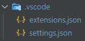

# Lint Config ZM S.A.

##### Repositório Privado | © ZM S.A.


Esse repositório é destinado às configurações de linting para repositórios da ZM S.A.

## Tabela de conteúdos

1. [Setup](#setup)
2. [Desenvolvimento](#desenvolvimento)
3. [Links Externos](#links-externos)

<hr />

## Setup

> O setup a seguir é destinado para o Vue.

Pré-requisitos: [Node.js](https://nodejs.org/) (recomendado: `>=18.13.0`)

**1. Instalar as dependências**:
```bash
npm i --save-dev eslint @zmgti/eslint-config
```

**2. Instalar as extensões recomendadas e alterar o [arquivo de configuração do VS Code](https://code.visualstudio.com/docs/getstarted/settings), utilizando a pasta `.vscode` como referência:**
<div align="start">
    
</div>

> Caso você não queria sobrescrever suas configurações de usuário, copie a pasta `.vscode` para a raiz do seu projeto. Por padrão, o VS Code irá priorizar as configurações do Workspace ao invés das suas.

**3. Criar o arquivo `eslint.config.js` na raiz do projeto, importando as configurações:**
```javascript
// eslint.config.js

const vueConfig = require('@zmgti/eslint-config/vue')

module.exports = {
   ...vueConfig
}
```

> O último caminho da importação deverá ser qual arquivo de config deseja-se utilizar. As opções disponíveis são os arquivos `.js` no repositório, voltados para stacks/tecnologias específicas.

**4. Copiar o arquivo `.editorconfig` para a raiz do seu projeto:**

Apesar desse repositório ser destinado às configurações do VS Code, o EditorConfig é algo que pode ser reaproveitado em várias IDEs, servindo como uma configuração base para todo o resto.

<hr />

## Desenvolvimento

As configurações são bem expansíveis para novas stacks/tecnologias:

**1. Clonar o repositório:**
```bash
git clone https://github.com/zmgti/eslint-config.git
```

**2. Criar uma branch nova:**
```bash
git branch <nome_da_branch>
git checkout <nome_da_branch>
```

**3. Criar um arquivo de configurações novo:**
```bash
touch <nome_da_ferramenta_ou_stack>.js
```

> Você pode criar o arquivo manualmente caso preferir

**4. Instalar as dependências (plugins e configs) que serão utilizadas:**
```bash
npm i --save-dev <deps>
```

> A compatibilidade entre as versões das dependências e plugins do ESLint muitas vezes se torna instável. Para controlar isso inicialmente, **executar o passo 2 é essencial**. Além disso, o comando `eslint --debug <caminho_arquivo>` é bem útil para visualizar uma stack dos erros.

**5. Boa Sorte!**

Agora é só configurar o arquivo com as regras e configurações optadas pela equipe.

Para testar as configurações em algum projeto real, basta utilizar o comando `npm i --save-dev eslint <caminho_lib>`, onde o caminho será onde o repositório local dessa biblioteca está, instalando apenas localmente.

**6. Subir uma Pull Request com o código pronto e testado para a branch `main`.**

<hr />

## Links Externos

- [ESLint Docs](https://eslint.org/docs/latest/)
- [Prettier](https://prettier.io/docs/en/index.html)
- [EditorConfig](https://editorconfig.org/)
